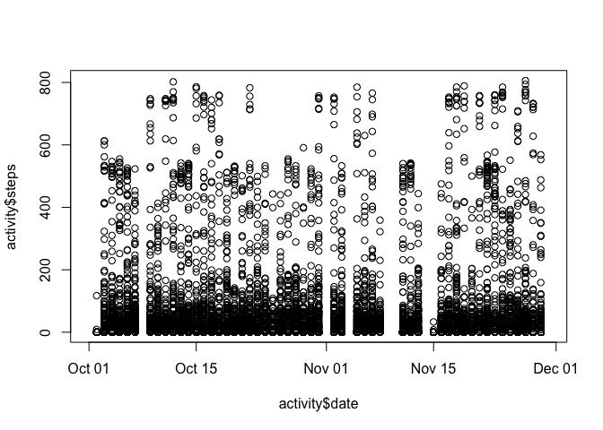
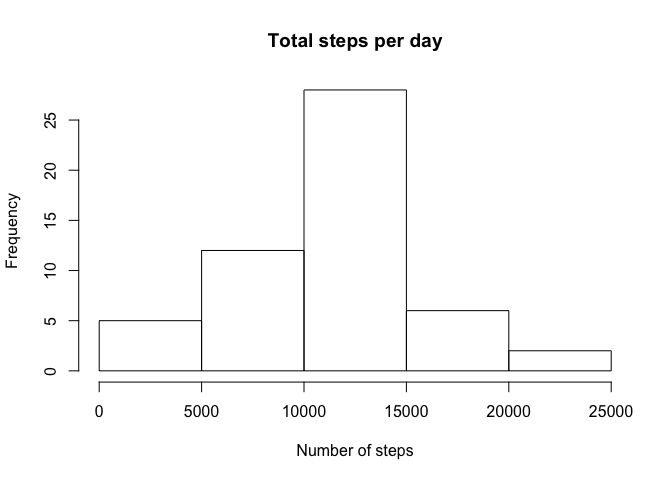
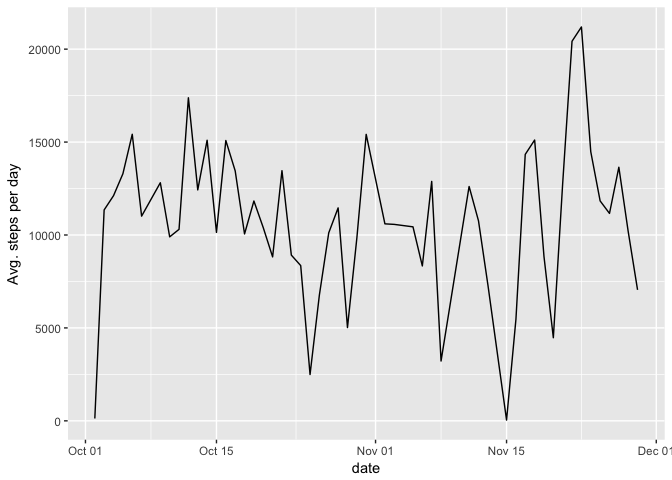
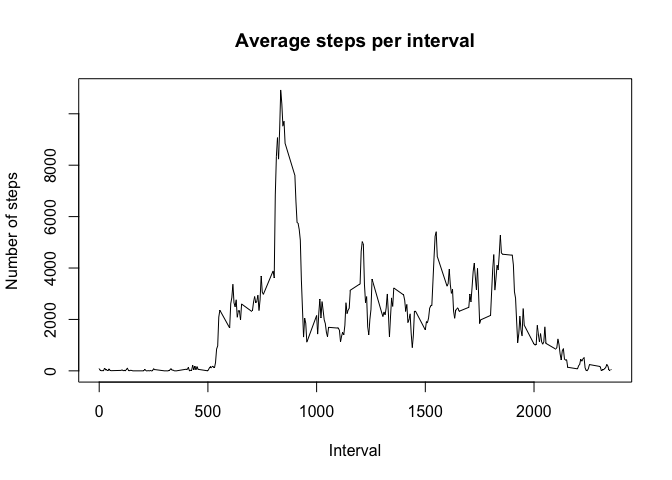
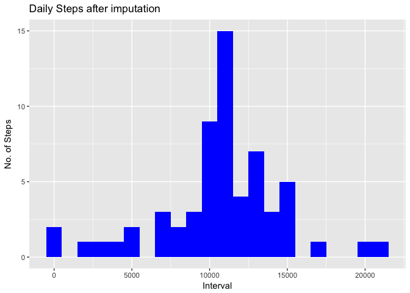
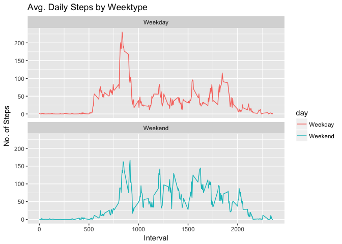

# Reproducible Research: Peer Assessment 1
# Activity Monitoring


## Loading and preprocessing the data


```r
library(readr)
library(dplyr)
```

```
## 
## Attaching package: 'dplyr'
```

```
## The following objects are masked from 'package:stats':
## 
##     filter, lag
```

```
## The following objects are masked from 'package:base':
## 
##     intersect, setdiff, setequal, union
```

```r
activity <- read_csv("~/Documents/Data Science/R/Coursera/activity.csv")
```

```
## Parsed with column specification:
## cols(
##   steps = col_integer(),
##   date = col_date(format = ""),
##   interval = col_integer()
## )
```

```r
head(activity)
```

```
## # A tibble: 6 × 3
##   steps       date interval
##   <int>     <date>    <int>
## 1    NA 2012-10-01        0
## 2    NA 2012-10-01        5
## 3    NA 2012-10-01       10
## 4    NA 2012-10-01       15
## 5    NA 2012-10-01       20
## 6    NA 2012-10-01       25
```

```r
summary(activity)
```

```
##      steps             date               interval     
##  Min.   :  0.00   Min.   :2012-10-01   Min.   :   0.0  
##  1st Qu.:  0.00   1st Qu.:2012-10-16   1st Qu.: 588.8  
##  Median :  0.00   Median :2012-10-31   Median :1177.5  
##  Mean   : 37.38   Mean   :2012-10-31   Mean   :1177.5  
##  3rd Qu.: 12.00   3rd Qu.:2012-11-15   3rd Qu.:1766.2  
##  Max.   :806.00   Max.   :2012-11-30   Max.   :2355.0  
##  NA's   :2304
```

```r
plot(activity$date, activity$steps)
```

<!-- -->

## Transforming the data/Histogram


```r
agg_steps <-  aggregate(steps ~ date, data=activity, FUN=sum)
colnames(agg_steps) <- c("Date","Steps")

hist(agg_steps$Steps , xlab="Number of steps", main="Total steps per day")
```

<!-- -->

## What is mean total number of steps taken per day?


```r
(mean(agg_steps$Steps,na.rm=TRUE))
```

```
## [1] 10766.19
```

```r
(median(agg_steps$Steps, na.rm=TRUE))
```

```
## [1] 10765
```
The average number of steps and median steps taken each day was 10766 and 10765 steps respectively.


## What is the average daily activity pattern?

```r
library(ggplot2)
ggplot(agg_steps, aes(agg_steps$Date,agg_steps$Steps)) +
        geom_line(data=agg_steps, aes(y=agg_steps$Steps)) +
        xlab("date") + ylab("Avg. steps per day")
```

<!-- -->

## Which 5-minute interval, on average across all the days in the dataset, contains the maximum number of steps?


```r
steps_interval<- aggregate(steps ~ interval, data=activity, FUN=sum)
steps_interval[which.max(steps_interval$steps),1]
```

```
## [1] 835
```

```r
plot(steps_interval$interval, steps_interval$steps, type='l', xlab='Interval', ylab='Number of steps', main="Average steps per interval")
```

<!-- -->

## Imputing missing values

```r
sum(is.na(activity$steps)==TRUE)
```

```
## [1] 2304
```
Total missing values in dataset are 2304 . 


```r
activity_new<- activity
nas<- is.na(activity_new$steps)
avg_interval<- tapply(activity_new$steps, activity_new$interval, mean, na.rm=TRUE, simplify = TRUE)
activity_new$steps[nas] <- avg_interval[as.character(activity_new$interval[nas])]
names(activity_new)
```

```
## [1] "steps"    "date"     "interval"
```

```r
sum(is.na(activity_new))
```

```
## [1] 0
```

```r
Total_Steps<- activity_new%>%
        group_by(date)%>%
        summarise(total_steps = sum(steps, na.rm=TRUE))
Total_Steps
```

```
## # A tibble: 61 × 2
##          date total_steps
##        <date>       <dbl>
## 1  2012-10-01    10766.19
## 2  2012-10-02      126.00
## 3  2012-10-03    11352.00
## 4  2012-10-04    12116.00
## 5  2012-10-05    13294.00
## 6  2012-10-06    15420.00
## 7  2012-10-07    11015.00
## 8  2012-10-08    10766.19
## 9  2012-10-09    12811.00
## 10 2012-10-10     9900.00
## # ... with 51 more rows
```

```r
#histogram after imputation
ggplot(Total_Steps, aes(x = total_steps)) +
        geom_histogram(fill = "blue", binwidth = 1000) +
        labs(title = "Daily Steps after imputation", x = "Interval", y = "No. of Steps")
```

<!-- -->

## Are there differences in activity patterns between weekdays and weekends?


```r
activity_new$day <- factor(ifelse(weekdays(activity_new$date)=='Sunday' | weekdays(activity_new$date)=='Saturday', "Weekend", "Weekday"))
head(activity_new)
```

```
## # A tibble: 6 × 4
##       steps       date interval     day
##       <dbl>     <date>    <int>  <fctr>
## 1 1.7169811 2012-10-01        0 Weekday
## 2 0.3396226 2012-10-01        5 Weekday
## 3 0.1320755 2012-10-01       10 Weekday
## 4 0.1509434 2012-10-01       15 Weekday
## 5 0.0754717 2012-10-01       20 Weekday
## 6 2.0943396 2012-10-01       25 Weekday
```

```r
str(activity_new)
```

```
## Classes 'tbl_df', 'tbl' and 'data.frame':	17568 obs. of  4 variables:
##  $ steps   : num  1.717 0.3396 0.1321 0.1509 0.0755 ...
##  $ date    : Date, format: "2012-10-01" "2012-10-01" ...
##  $ interval: int  0 5 10 15 20 25 30 35 40 45 ...
##  $ day     : Factor w/ 2 levels "Weekday","Weekend": 1 1 1 1 1 1 1 1 1 1 ...
##  - attr(*, "spec")=List of 2
##   ..$ cols   :List of 3
##   .. ..$ steps   : list()
##   .. .. ..- attr(*, "class")= chr  "collector_integer" "collector"
##   .. ..$ date    :List of 1
##   .. .. ..$ format: chr ""
##   .. .. ..- attr(*, "class")= chr  "collector_date" "collector"
##   .. ..$ interval: list()
##   .. .. ..- attr(*, "class")= chr  "collector_integer" "collector"
##   ..$ default: list()
##   .. ..- attr(*, "class")= chr  "collector_guess" "collector"
##   ..- attr(*, "class")= chr "col_spec"
```

## Panel plot for weekdays and weekends

```r
Interval<- activity_new %>%
        group_by(interval, day) %>%
        summarise(avg_steps = mean(steps, na.rm=TRUE))
head(Interval)
```

```
## Source: local data frame [6 x 3]
## Groups: interval [3]
## 
##   interval     day  avg_steps
##      <int>  <fctr>      <dbl>
## 1        0 Weekday 2.25115304
## 2        0 Weekend 0.21462264
## 3        5 Weekday 0.44528302
## 4        5 Weekend 0.04245283
## 5       10 Weekday 0.17316562
## 6       10 Weekend 0.01650943
```

```r
plot<- ggplot(Interval, aes(x =interval , y=avg_steps, color=day)) +
       geom_line() +
       labs(title = "Avg. Daily Steps by Weektype", x = "Interval", y = "No. of Steps") +
       facet_wrap(~day, ncol = 1, nrow=2)
print(plot)
```

<!-- -->

From the plots and the data , it is clear that people are active over the weekend compared to the weekdays which makes us understand that people are less active during work hours.


